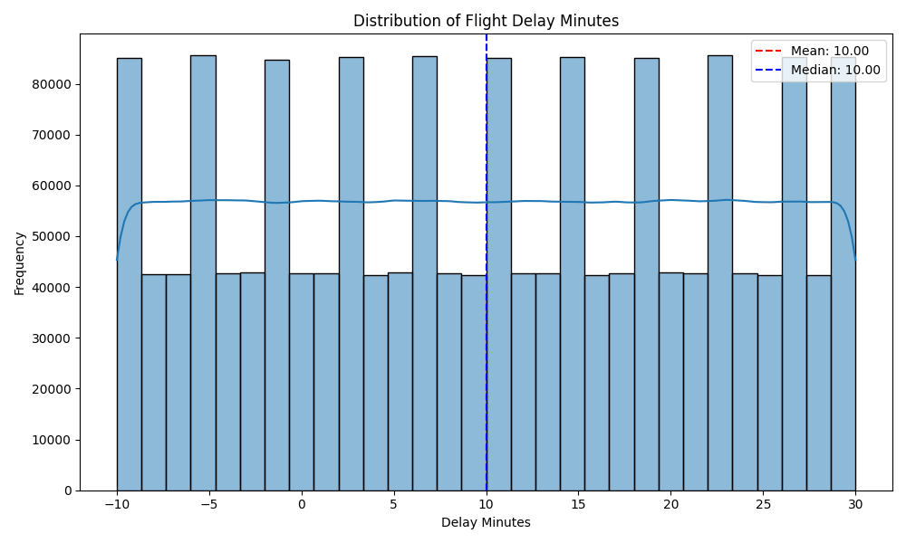
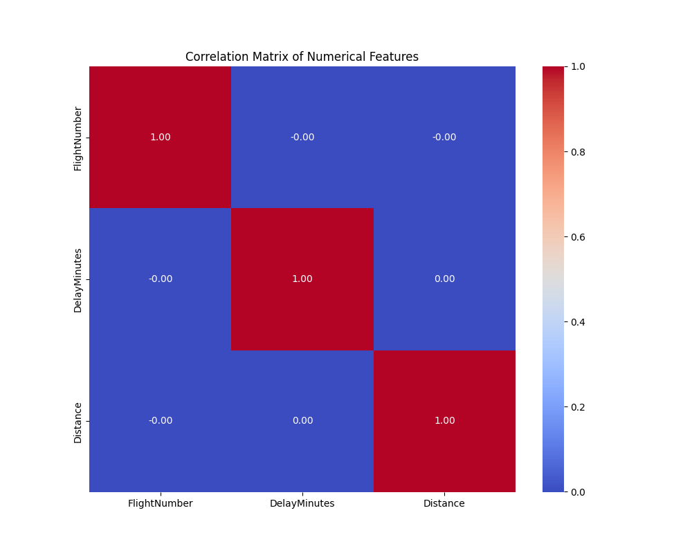
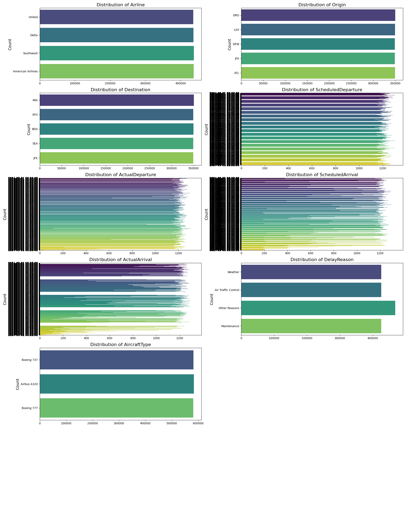

### Predicting Flight Delays

**Author**
Anupama Deshmukh

#### Executive summary
Predict the likelihood and extent of flight delays based on historical data and current conditions. 
This prediction would make passengers travel easy and enjoyable, in addition to other benefits that are 
mentioned in the expected results

#### Rationale
Data Trends: Historical data shows patterns in delays based on time of day, season, and airport congestion. 
For instance, certain routes may consistently experience delays during peak travel times.
Weather Impacts: Historical weather data can indicate how often certain weather conditions lead to delays.

Current Conditions:
Weather Forecasts  : Real-time weather updates (like storms or heavy winds) can significantly impact flight schedules.
Air Traffic Control: Certain routes are more prone to delays due to air traffic patterns or geographic factors.
Other Factors      : Festival travels, conferences and Special Events can increase passenger volumes, 
                     impacting flight schedules
Real-time Tracking : Integrating live data from various sources (weather, airport status, etc.) enhances prediction accuracy.
Statistical Models : Utilizing machine learning algorithms or statistical methods can help in modeling and predicting 
                     delays based on the above factors.

#### Research Question
*Key Factors in Prediction*
Flight Route         : Certain routes are more prone to delays due to various reasons weather, maintenance, 
                       air traffic and other reasons
Historical Delay Data: Analyzing past delays for specific flights or airlines can provide insights.
Real-time Tracking   : Integrating live data from various sources (weather, airport status, etc.) 
                       enhances prediction accuracy.
Statistical Models   : Utilizing machine learning algorithms or statistical methods can help in modeling 
                       and predicting delays based on the above factors.

By combining these elements, airlines, passengers, and airport authorities can better manage schedules,
reduce inconveniences, and improve overall efficiency in air travel.

#### Data Sources
Datasource : https://www.kaggle.com/datasets/umeradnaan/flight-delays-dataset

##Flight Id and TailNumber not used for modeling. Hence removed from the data structure
Data Structure 

Airline	     				: Airline name 	
FlightNumber 				:	Flight number 	
Origin	    		  	: Departure airport 
Destination	 				: Arrival airport 	
ScheduledDeparture	: Scheduled departure time 	
ActualDeparture	    : Actual departure time 
ScheduledArrival	  : Scheduled arrival time 	
ActualArrival	      : Actual arrival time 
DelayMinutes	      : Delay in minutes 	
DelayReason	        : Reason for delay 	
Canceled	          : Whether the flight was canceled

Regression          : DelayMinutes :  Predict how many minutes a flight will be delayed.  
Classification      : DelayReason : Predict the reason for a flight delay   
Expected Results    : Develop a model to predict flight delays, enhance operational efficiency,and improve passenger experience.

#### Methodology
Perform Exploratory data analysis : Data Collection (Kaggle), Data Cleaning, Data Profiling, Visualizations

Data  Preparation : Cleaning, Feature engineering, encoding of categorical variables using techniques like (delayed, canceled),feature selection to improve model performance and reduce over fitting
Data Preprocessing : Identity Feature and Target variables, Create Training and Test Datasets, using train_test_split function from the sklearn.model_selection module. 

Build model : Use Machine Learning Algorithm to build a  models using Logistic Regression, Decision Trees, Random Fores
               Gradient Boosting Machines, Support Vector Machines
Train the model : Use training dataset
Evaluate Model :  Evaluate the model's performance using the testing data. 
                  Use Classification Metrics: Accuracy, precision, recall, F1 score 
                  Use Regression Metrics: Mean Absolute Error (MAE), Mean Squared Error (MSE), and R-squared to assess prediction accuracy.

Validate the model:  Use Cross-Validation and Hyper parameter Tuning

Prediction : Use the trained model to make predictions on new data.
Deployment : This model is ready to deploy

Predicting flight delays is crucial for improving passenger experience, optimizing airline operations, 
enhancing safety and compliance, and supporting economic efficiency. It leads to cost savings, better resource management, 
and overall operational effectiveness, benefiting passengers, airlines, and the broader aviation industry.

#### Results
Unique airlines : 'United' 'Delta' 'Southwest' 'American Airlines'
Numeric Features:  ['FlightNumber', 'DelayMinutes', 'Distance']
                   FlightID is not very useful for this analysis, hence, this is dropped column from main dataset

Below graph shows numeric feature distributions, based on distance travelled and delay timings in the arrivals 
All lines max distance ranges between 3000 - 10000 miles, as shown in the distribution graph 

Interpretation:  Maximum time delay is 30 minutes

## Distribution of Flight Delay Minutes

The histogram above shows the distribution of flight delay minutes.
   - The delay pattern, shows the delay timings is 30 minutes, which is manageable, still can impact connection flights
	 - This gives agents at gate can give more accurate update their customers that can avoid chaos and confusions
   - Monitoring delay timings and maintaining a log, increases operational efficiency, and incorporate best practices from their own experieces
	 

The correlation matrix shows, there is same impact between all airlines:
based on distance flown and delayed minutes, no matter which arilines is taken.

Categorical Columns: ['Airline', 'Origin', 'Destination', 'ScheduledDeparture', 'ActualDeparture', 'ScheduledArrival', 'ActualArrival', 'DelayReason', 'AircraftType']

data/flights_by_airline.png

Almost all airlines shows same number of flights, having very less differences.
However, the categorical feature distribution, showing Reasons for Delay, almost all airlines have more 'Other Reasons'.
Maintenance, Air traffic control and weather are common reasons for delay.

Frequency of Delays: The counts associated with each delay reason indicate how often those issues affect flights. 
                      "Maintenance" and "Other Reasons" are significant contributors to delays 
											for these airlines, suggesting operational challenges or unexpected issues.

Airline Performance: Comparing delay reasons across airlines can highlight performance differences. 
                     Almost equal counts for delay reason, shows these are common industry-wide issues, 
										 like air traffic control delays.

Operational Factors: The presence of delays due to "Maintenance" suggest that an airline is either facing aging fleet issues
                      or is stringent on safety checks. If aging fleet is the reason, further research is required, 
											before giving recommendations for parts or service replacement, or complete replacement of the aircraft.

External Influences: Weather delays, though not as high for Airlines compared to maintenance, 
                     can still significantly impact overall performance. 
										 An airline's ability to handle such delays can affect customer satisfaction.

Data Comparisons:  Dataset includes similar data for all airlines (Delta, American, Southwest and United) 

#### Next steps
Overall, this data could help in identifying areas for improvement, assessing operational efficiency, and 
understanding customer experience related to delays.

#### Outline of project

##### Contact and Further Information
Anupama Deshmukh (anupama.rdeshmukh@gmail.com)
